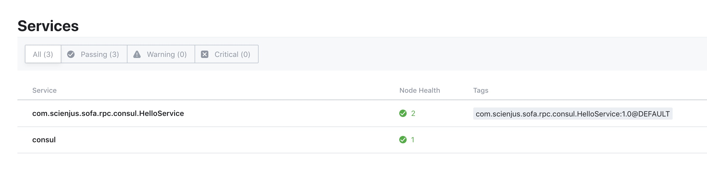
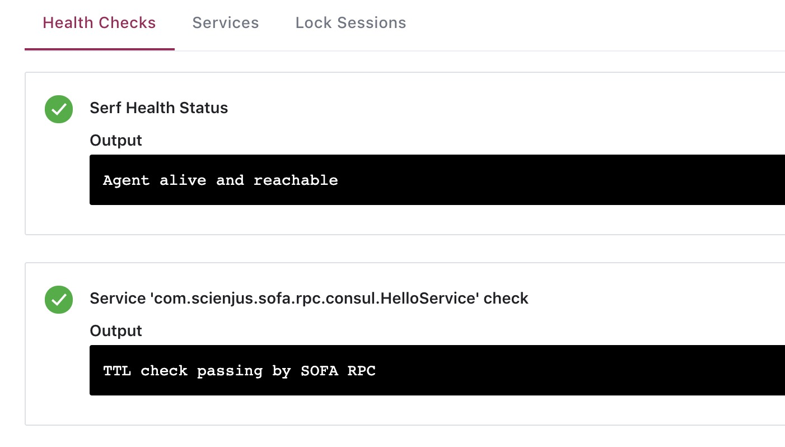
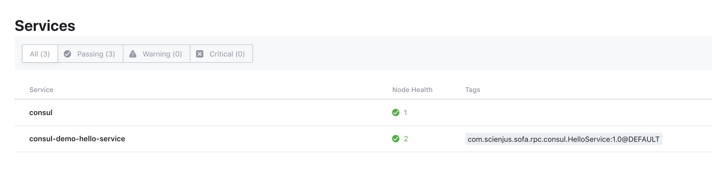
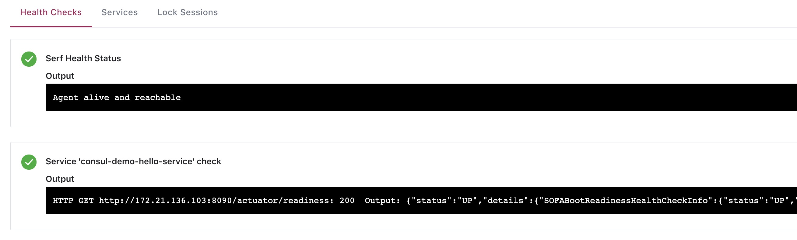

# SOFA RPC Consul Registry Demo

这是一个基于 [sofa-rpc](https://github.com/sofastack/sofa-rpc) 5.6.0 版本 consul-registry 演示的 demo，会介绍如何使用 consul 作为 sofa-rpc 的注册中心，并使用自定义的 service name、health check 配置。

## Step 1，基础服务搭建

参考 pom 中的依赖配置和 src 下的 `HelloController`、`HelloService` 和 `HelloServiceImpl`，搭建一个最小的 sofa-rpc 调用环境。

为了演示自定义 http health check 的效果，我们额外引入了 `healthcheck-sofa-boot-starter`，启动后可以在 `/actuator/readiness` 中查看到服务的健康状态。

## Step 2，使用 Consul Registry

使用 consul registry 需要在 pom 中额外加入 consul 依赖，这里使用的版本为 `com.ecwid.consul:consul-api:1.4.2`。

然后在 `application.yml` 中，通过 `com.alipay.sofa.rpc.registry.address` 配置 consul 注册中心的地址，最简配置为：`consul://127.0.0.1:8500`。

## Step 3，启动服务

在本地启动 consul server（例如 `consul agent -dev`）后启动服务，查看 `localhost:8500` 的 consul ui，可以看到服务已经注册成功。



点击可以看到服务的健康检查信息，默认的健康检查方式是 ttl 定期上报。



访问提供的接口 `http://localhost:8090/say/hello-world`，可以看到正常调用并得到了返回信息。

## Step 4，使用自定义别名

默认的 consul 服务名对应 sofa-rpc 中的 interfaceId，但是因为 interfaceId 比较长可能不利于人类阅读，并且其中含有 `.` 导致无法使用 consul 的 dns 功能，所以可以通过配置给每一个服务配置更可读的名称。

通过 `@SofaServiceBinding` 和 `@SofaReferenceBinding` 的 `paramters` 变量可以配置参数信息，使用 `ConsulConstants.CONSUL_SERVICE_NAME_KEY` 可以修改注册的 service name。

```
@SofaService(
        bindings = @SofaServiceBinding(
                bindingType = "bolt",
                parameters = @SofaParameter(key = ConsulConstants.CONSUL_SERVICE_NAME_KEY, value = "${spring.application.name}-hello-service")
        )
)
```

```
@SofaReference(
        binding = @SofaReferenceBinding(
                bindingType = "bolt",
                parameters = @SofaParameter(key = ConsulConstants.CONSUL_SERVICE_NAME_KEY, value = "${spring.application.name}-hello-service")
        ),
        jvmFirst = false
)
private HelloService helloService;
```

注意：service 和 reference 中的配置必须相同才能正常进行服务发现，否则 refernce 将无法找到 service。

启动后可以再次查看 consul ui，可以看到 service name 变成了修改后的值。



此时也可以通过 consul dns 进行服务发现：

```
$ dig @127.0.0.1 -p 8600 consul-demo-hello-service.service.consul

; <<>> DiG 9.10.6 <<>> @127.0.0.1 -p 8600 consul-demo-hello-service.service.consul
; (1 server found)
;; global options: +cmd
;; Got answer:
;; ->>HEADER<<- opcode: QUERY, status: NOERROR, id: 62838
;; flags: qr aa rd; QUERY: 1, ANSWER: 1, AUTHORITY: 0, ADDITIONAL: 2
;; WARNING: recursion requested but not available

;; OPT PSEUDOSECTION:
; EDNS: version: 0, flags:; udp: 4096
;; QUESTION SECTION:
;consul-demo-hello-service.service.consul. IN A

;; ANSWER SECTION:
consul-demo-hello-service.service.consul. 0 IN A 172.21.136.103

;; ADDITIONAL SECTION:
consul-demo-hello-service.service.consul. 0 IN TXT "consul-network-segment="

;; Query time: 0 msec
;; SERVER: 127.0.0.1#8600(127.0.0.1)
;; WHEN: Mon Jun 24 22:55:58 CST 2019
;; MSG SIZE  rcvd: 121
```

## Step 5，使用自定义健康检查

consul 作为注册中心的一个非常强大的特性就是，它支持 agent 主动发起健康检查，例如 http/tcp 调用，而不仅仅依赖于应用的 ttl 上报。

配置自定义的健康检查只需要修改 `application.yml` 中的 `com.alipay.sofa.rpc.registry.address`，在 url 的 query 参数中增加对应配置即可。

以使用 sofa-boot 的 readiness endpoint 进行健康检查为例，只需要配置 `healthCheck.type` 为 http、`healthCheck.port` 为 `server.port`、`healthCheck.path` 为 `/actuator/readiness` 即可：

```
com:
  alipay:
    sofa:
      rpc:
        registry:
          address: consul://127.0.0.1:8500?healthCheck.type=http&healthCheck.path=/actuator/readiness&healthCheck.port=${server.port}
```

修改后重启应用，查看 consul ui，等待 consul agent 进行第一次健康检查之后，查看健康检查信息，可以发现 output 一栏中显示着 health check 的结果。

